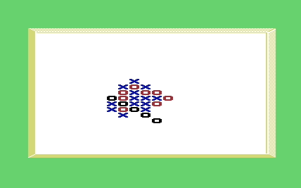
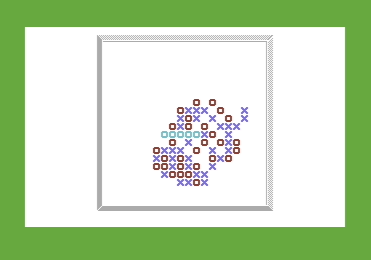

The classic pen and paper game ported for the Commodore VIC-20 (and C64 and C16 too!) the more refined the playing strategy became. When the CPU started to defeat me on a regular basis, I stopped improving the engine. Amateur Gomoku players will find moderately difficult to beat the computer, so they will enjoy challenging the VIC-20 and still have possibility to win

Original Website: http://antoninoporcino.xoom.it/Vic20/gomoku.htm
© 1998-2008 Nino Porcino iz8bly@yahoo.it

The classic pen and paper game ported for the Commodore VIC-20 (and C64 and C16 too!) the more refined the playing strategy became. When the CPU started to defeat me on a regular basis, I stopped improving the engine. Amateur Gomoku players will find moderately difficult to beat the computer, so they will enjoy challenging the VIC-20 and still have possibility to win. The core of the program playing strategy relies on the ability to recognize some basic patterns on the board. To do this, the program scans for patterns directly on the video memory, using the 6502 Y-register to index along the cardinal directions. Then it computes a "score" for each free cell (also in video memory, in white color so it's all hidden) and picks the one that it's supposed to lead to the best move. If you want to see how the thinking engine works internally, do the following: cool effect, eh?. If you want to learn more about how the program works, you can look at the program's source code--I've fully commented it for your convenience. I also forced myself to keep comments and variable names in english (my native language being italian). The source should be quite easy to read because it's not the usual cryptic 6502 code, but it's written in a pseudo-macro language of my own that makes assembler very similar to structured Basic (see it to believe). All program subroutines are all also summarized on top of the file, for better comprehension. And if you still have some doubts, you can ask me :) A word on the C64 and C16 versions After finishing the VIC-20 version, I converted the program first to C64 and then to C16 / Plus4. The major obstacle was adapting the pattern scanning routines to a larger screen, because moving on the 8 cardinal directions on a 40 columns screen exceeds the 256 bytes indexing limit of the 6502 -- a problem that you don't have in the 22 column screen of the VIC20. Also the C64 and the C16 have different video chip registers, so I had to find all the corresponding locations and values to write in. The Kernal ROM routines are a little different too, but I was able to use the standard calls like GETIN, PRNSTR, PRNINT with only few modifications. Program variables, in all the three versions, share the same zero page assignment -- it was quite difficult to find an assignment not causing conflict with the O.S. on all three machines (C64 and VIC20 are very similar in this regard). If you like the game and play it, I am curious to know how good the CPU is at playing, so let me know. I hope you enjoy it! Š 1998-2008 Nino Porcino iz8bly@yahoo.it